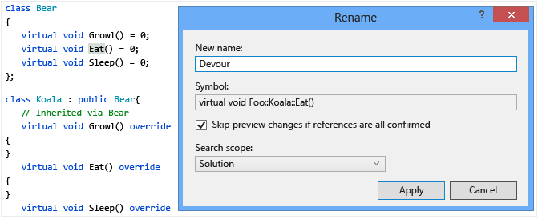
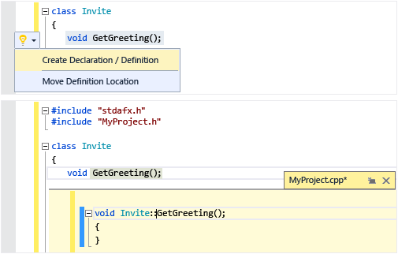
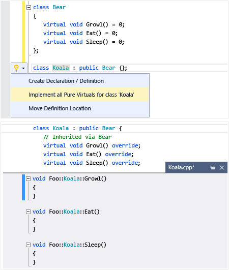

# C&#243;digo de grava&#231;&#227;o e de refatora&#231;&#227;o (C++)
[!INCLUDE[vs2017banner](../assembler/inline/includes/vs2017banner.md)]

O editor de códigos do Visual C\+\+ e o IDE fornecem muitos recursos de codificação.  Algumas são exclusivas para C\+\+ e alguns são essencialmente as mesmas para todos os idiomas do Visual Studio.  Opções para habilitar e configurar esses recursos estão localizadas na caixa de diálogo Editor de texto avançado de C\+\+ \(**Ferramentas &#124; Opções &#124; Editor de texto &#124; C\/C\+\+ &#124; Advanced**ou digite "C\+\+ Avançado"**início rápido**\).  Depois de escolher a opção que você deseja definir, você pode obter mais Ajuda pressionando**F1**quando a caixa de diálogo estiver em foco.  Para as opções de formatação de código geral, digite`Editor C++`em**QuickLaunch**.  
  
## Adicionar novo código  
 Depois de criar um projeto, você pode começar a codificar nos arquivos que foram gerados para você.  Para adicionar novos arquivos, clique com botão direito no nó do projeto no Solution Explorer e escolha**Adicionar &#124; Novo**.  
  
 Para definir opções de formatação como recuos, preenchimento de chaves e colorização, digite`formatação C++`para o**QuickLaunch**janela.  
  
### IntelliSense  
 IntelliSense é o nome de um conjunto de recursos que fornecem informações embutidas sobre sobrecargas de função, tipos e membros.  A ilustração a seguir mostra a lista de membros lista suspensa que aparece à medida que você digita.  Você pode pressionar a tecla tab para inserir o texto do item selecionado em seu arquivo de código.  
  
   
  
 Para obter mais informações, consulte[Intellisense do Visual C\+\+](../Topic/Visual%20C++%20Intellisense.md).  
  
### Inserir trechos  
 Um trecho é uma parte predefinida do código\-fonte.  Clique em um único ponto ou no texto selecionado para inserir um trecho de código ou colocar o texto selecionado com o trecho de código.  A ilustração a seguir mostra as três etapas para colocar uma instrução selecionada com um loop for.  Os destaques amarelos na imagem final são campos editáveis que você acesse com a tecla tab.  Para obter mais informações, consulte[trechos de código](../Topic/Code%20Snippets.md).  
  
   
  
### Adicionar Classe  
 Adicionar uma nova classe de**projeto**menu usando o Assistente de classe.  
  
   
  
### Assistente de classe  
 Modificar ou examinar uma classe existente ou adicione uma nova classe usando o Assistente de classe.  Para obter mais informações, consulte[adicionando funcionalidade com assistentes de código \(C\+\+\)](../ide/adding-functionality-with-code-wizards-cpp.md).  
  
   
  
## Refatoração  
 Refatorações estão disponíveis sob o item de menu de contexto da ação rápida ou clicando em um[lâmpada](../Topic/Perform%20quick%20actions%20with%20light%20bulbs.md)no editor.  
  
### Renomear  
 Renomear um tipo ou função ou variável sempre que ele é usado no escopo especificado.  Na ilustração a seguir, o`Eat`método será renomeado como`Devour`na classe base e derivada.  
  
   
  
### Rápida de ação: Local de definição de movimentação  
 Mova uma ou mais definições de função para o arquivo de cabeçalho que tem o mesmo nome do arquivo de código.  Um novo cabeçalho será criado se ele ainda não existir.  As definições de resultante está \(ão\) embutido mostrado em uma janela de inspeção.  
  
   
  
### Ação rápida: Criar declaração \/ definição  
 Crie uma ou mais definições no arquivo de código associado para os ções cabeçalho selecionado.  
  
   
  
### Ação rápida: Implementar todos os puros virtuais para uma classe  
 Gere stubs de implementação vazia para todas as funções virtuais herdadas rapidamente em uma classe.  Para implementar apenas as funções virtuais em uma classe base específica, basta destacar a classe base na declaração da classe derivada.  
  
   
  
### Converter em um literal de cadeia de caracteres bruta  
 Quando você coloca o cursor sobre uma cadeia de caracteres literal, você pode clique com botão direito e escolha**rápida ações &#124; Converter em um literal de cadeia de caracteres bruta**para converter uma cadeia de caracteres comum em um literal de cadeia bruto C\+\+ 11.  
  
   
  
### Extrair a função \(extensão do Visual Studio\)  
 Use o recurso de função extract \(disponível como um[extensão na Galeria do Visual Studio](https://visualstudiogallery.msdn.microsoft.com/a081dc8c-c805-4589-9b8b-c2c309a05789)\) para mover uma seção de código em sua própria função e substitua o código com uma chamada para essa função.  
  
   
  
## Navegue e entender  
  
### Inforapida  
 Passe o mouse sobre uma variável para ver as informações de tipo.  Inforapida  
  
   
  
### Documento aberto \(navegar até o cabeçalho\)  
 Clique com o botão direito no nome do cabeçalho em um`#include`diretiva e abra o arquivo de cabeçalho.  
  
   
  
### Inspecionar Definição  
 Passe o mouse sobre uma variável ou função declaração, com o botão direito, em seguida, escolha**inspecionar definição**para ver uma exibição embutida de sua definição.  Para obter mais informações, consulte[inspecionar definição \(Alt \+ F12\)](../Topic/How%20to:%20View%20and%20Edit%20Code%20by%20Using%20Peek%20Definition%20\(Alt+F12\).md).  
  
   
  
### Ir para definição  
 Passe o mouse sobre uma variável ou função declaração, com o botão direito, em seguida, escolha**Go To Definition**para abrir o documento em que o objeto é definido.  
  
### Exibir Hierarquia de Chamada  
 Clique com o botão direito em qualquer chamada de função e exibir uma lista de Recursive de todas as funções que ele chama e todas as funções que chamá\-lo.  Cada função na lista pode ser expandida da mesma maneira.  Para obter mais informações, consulte[Call Hierarchy](../Topic/Call%20Hierarchy.md).  
  
   
  
### Alternar Cabeçalho\/Arquivo de Códigos  
 Com o botão direito e escolha Alternar cabeçalho \/ arquivo de código para alternar entre um arquivo de cabeçalho e seu arquivo de código associado.  
  
### Estrutura de tópicos  
 Clique duas vezes em um arquivo de código fonte e escolha**estrutura de tópicos**para recolher ou expandir as definições e\/ou regiões personalizadas para facilitar a procurar apenas as partes que lhe interessam.  Para obter mais informações, consulte[Estrutura de tópicos](../Topic/Outlining.md).  
  
   
  
### Modo de mapa da barra de rolagem  
 Modo de mapa do ScrollBar permite que você rapidamente role e procurar por meio de um arquivo de código sem realmente deixar seu local atual.  Ou clique em qualquer lugar no mapa de código para ir diretamente para esse local.  
  
   
  
### Gerar o gráfico de arquivos de inclusão  
 Clique com o botão direito em um arquivo de código no seu projeto e escolha**Gerar gráfico de arquivos de inclusão**para ver um gráfico dos quais arquivos são incluídos por outros arquivos.  
  
   
  
### F1 Ajuda  
 Coloque o cursor sobre ou imediatamente após qualquer tipo, a palavra\-chave ou a função e pressione F1 para ir diretamente para o tópico de referência relevante do MSDN.  F1 também funciona em itens na lista de erros e em muitas caixas de diálogo.  
  
### Início Rápido  
 Para navegar facilmente para qualquer janela ou uma ferramenta no Visual Studio, basta digite seu nome na janela de início rápido no canto superior direito da interface do usuário.  Filtre a lista de preenchimento automático à medida que você digita.  
  
 