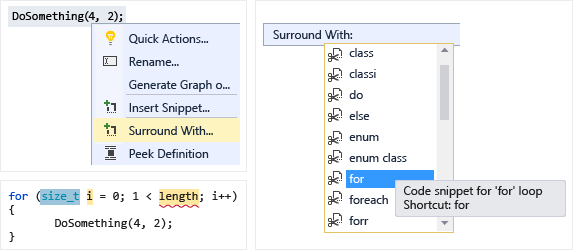
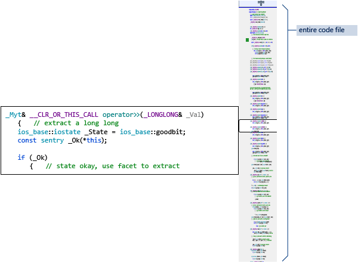
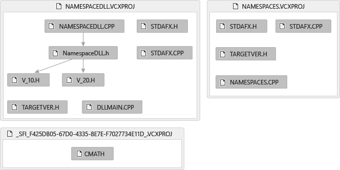

# Escrevendo e refatorando um código (C++)

O editor de códigos e o IDE do Visual C++ fornecem muitos recursos de codificação. Alguns são exclusivos ao C++ e outros são essencialmente os mesmos para todas as linguagens Visual Studio. Para obter mais informações sobre as funcionalidades compartilhadas, confira [Escrevendo um código no Editor de Códigos e de Texto](/visualstudio/ide/writing-code-in-the-code-and-text-editor). As opções para habilitar e configurar funcionalidades específicas ao C++ estão localizadas em **Ferramentas &#124; Opções &#124; Editor de Texto &#124; C/C++**. Depois de escolher a opção que deseja definir, você obtenha mais ajuda pressionando **F1** quando a caixa de diálogo estiver no foco. Para obter opções gerais de formatação de código, digite `Editor C++` em **QuickLaunch**.

As funcionalidades experimentais, que podem ou não ser incluídas em uma versão futura do Visual Studio, são encontradas na caixa de diálogo [Experimental do C++ do Editor de Texto](/visualstudio/ide/reference/options-text-editor-c-cpp-experimental). No Visual Studio 2017, você pode habilitar o **IntelliSense Preditivo** nessa caixa de diálogo.

## Adicionando novos arquivos

Para adicionar novos arquivos a um projeto, clique com o botão direito do mouse no nó do projeto no Gerenciador de Soluções e escolha **Adicionar &#124; Novo**.

## Opções de formatação

Para definir opções de formatação como recuos, preenchimento de chaves e colorização, digite "Formatação do C++" na janela **QuickLaunch**. O Visual Studio 2017 versão 15.7 e posterior dá suporte a ClangFormat. Configure-o na [Página de Propriedades de Formatação do C/C++](/visualstudio/ide/reference/options-text-editor-c-cpp-formatting) em **Ferramentas &#124; Opções &#124; Editor de Texto &#124; C/C++ &#124; Formatação**.

## IntelliSense

O IntelliSense é o nome de um conjunto de funcionalidades que fornecem informações embutidas sobre membros, tipos e sobrecargas de função. A ilustração a seguir mostra a lista suspensa de membros exibida conforme você digita. Pressione a tecla TAB para inserir o texto do item selecionado no arquivo de código.

Para obter informações completas, confira [Visual C++ IntelliSense](/visualstudio/ide/visual-cpp-intellisense).

## Inserir trechos

Um trecho é uma parte predefinida do código-fonte. Clique com o botão direito do mouse em um único ponto ou no texto selecionado para inserir um trecho ou colocar o texto selecionado entre o trecho. A ilustração a seguir mostra as três etapas para colocar uma instrução selecionada entre um loop for. Os realces em amarelo na imagem final são campos editáveis acessados com a tecla TAB. Para obter mais informações, consulte [Trechos de Código](/visualstudio/ide/code-snippets).

## Adicionar Classe

Adicione uma nova classe por meio do menu **Projeto** usando o Assistente de Classe.

Use também o Assistente de Classe para modificar ou examinar uma classe existente.

Para obter mais informações, confira [Adicionando funcionalidade com assistentes de código (C++)](../ide/adding-functionality-with-code-wizards-cpp.md).

## Refatoração

As refatorações estão disponíveis no menu de contexto de Ação Rápida ou clicando em uma [lâmpada](/visualstudio/ide/perform-quick-actions-with-light-bulbs) no editor.  Algumas também são encontradas no menu **Editar > Refatorar**.  Esses recursos incluem:

* [Renomear](refactoring/rename.md)
* [Extrair função](refactoring/extract-function.md)
* [Implementar virtuais puras](refactoring/implement-pure-virtuals.md)
* [Criar declaração/definição](refactoring/create-declaration-definition.md)
* [Mover definição de função](refactoring/move-definition-location.md)
* [Converter para literal de cadeia de caracteres bruta](refactoring/convert-to-raw-string-literal.md)
* [Alterar assinatura](refactoring/change-signature.md)

## Navegar e compreender

O Visual C++ compartilha muitas funcionalidades de navegação de código com outras linguagens. Para obter mais informações, confira [Navegando pelo código](/visualstudio/ide/navigating-code) e [Exibindo a estrutura do código](/visualstudio/ide/viewing-the-structure-of-code).

## QuickInfo

Focalize uma variável para ver suas informações de tipo.

## Abrir documento (Navegar para o cabeçalho)

Clique com o botão direito do mouse no nome do cabeçalho em uma diretiva `#include` e abra o arquivo de cabeçalho.

## Inspecionar Definição

Focalize uma variável ou uma declaração da função, clique com o botão direito do mouse e, em seguida, escolha **Inspecionar Definição** para ver uma exibição embutida de sua definição. Para obter mais informações, confira [Inspecionar Definição (Alt+F12)](/visualstudio/ide/how-to-view-and-edit-code-by-using-peek-definition-alt-plus-f12).

## Ir para definição

Focalize uma variável ou uma declaração da função, clique com o botão direito do mouse e, em seguida, escolha **Ir para definição** para abrir o documento no qual o objeto está definido.

## Exibir Hierarquia de Chamada

Clique com o botão direito do mouse em qualquer chamada de função e exiba uma lista recursiva de todas as funções chamadas por ela e todas as funções que a chamam. Cada função na lista pode ser expandida da mesma maneira. Para obter mais informações, confira [Hierarquia de chamada](/visualstudio/ide/reference/call-hierarchy).

## Ativar/Desativar Arquivo de Cabeçalho/Código

Clique com o botão direito do mouse e escolha **Ativar/Desativar Arquivo de Cabeçalho/Código** para alternar entre um arquivo de cabeçalho e seu arquivo de código associado.

## Estrutura de tópicos

Clique com o botão direito do mouse em qualquer lugar em um arquivo de código-fonte e escolha **Estrutura de Tópicos** para recolher ou expandir as definições e/ou regiões personalizadas, a fim de facilitar a navegação apenas pelas partes de seu interesse. Para obter mais informações, consulte [Estrutura de tópicos](/visualstudio/ide/outlining).

## Modo de mapa de barra de rolagem

O modo de mapa de barra de rolagem permite que você role e navegue por um arquivo de código rapidamente sem, de fato, sair do local atual. Se preferir, clique em qualquer lugar no mapa de códigos para ir diretamente para esse local. Para obter mais informações, confira [Como acompanhar o código personalizando a barra de rolagem](/visualstudio/ide/how-to-track-your-code-by-customizing-the-scrollbar).

## Gerar grafo de arquivos de inclusão

Clique com o botão direito do mouse em um arquivo de código no projeto e escolha **Gerar grafo de arquivos de inclusão** para ver um grafo de quais arquivos são incluídos por outros arquivos.

## F1 Ajuda

Posicione o cursor sobre ou imediatamente após qualquer tipo, palavra-chave ou função e pressione F1 para ir diretamente para o tópico de referência relevante em docs.microsoft.com. F1 também funciona em itens da lista de erros e em muitas caixas de diálogo.

## Início Rápido

Para navegar com facilidade para qualquer janela ou ferramenta no Visual Studio, basta digitar seu nome na janela Início Rápido no canto superior direito da interface do usuário. A lista de preenchimento automático fará a filtragem conforme você digita.

