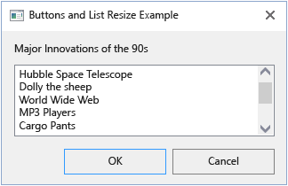
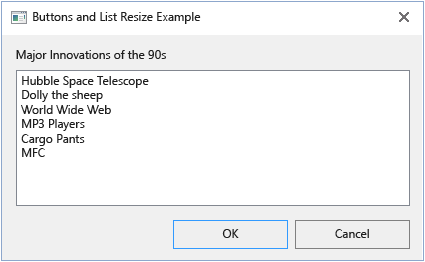
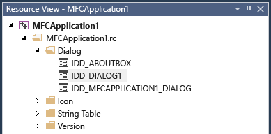
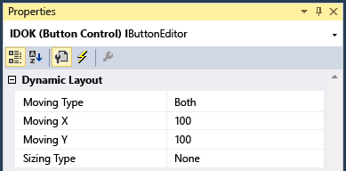
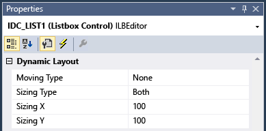

# Layout din&#226;mico
[!INCLUDE[vs2017banner](../assembler/inline/includes/vs2017banner.md)]

Com o MFC em [!INCLUDE[vs_dev14](../mfc/includes/vs_dev14_md.md)], você pode criar caixas de diálogo que o usuário pode redimensionar e você pode controlar a maneira que o layout será ajustado para a alteração no tamanho.  Por exemplo, você pode anexar botões na parte inferior de uma caixa de diálogo para a margem inferior para que permaneçam sempre na parte inferior.  Você também pode configurar determinados controles, como caixas de listagem, editboxes e campos de texto para expandir conforme o usuário expande a caixa de diálogo.  
  
## Especificando configurações de layout dinâmico para uma caixa de diálogo do MFC  
 Quando o usuário redimensiona uma caixa de diálogo, os controles na caixa de diálogo para redimensionar ou mover nas direções X e Y.  A alteração no tamanho ou a posição de um controle quando o usuário redimensiona uma caixa de diálogo é chamada de layout dinâmico.  Por exemplo, o seguinte é uma caixa de diálogo antes que seja redimensionada:  
  
   
  
 Após ser redimensionado, aumenta a área da caixa de listagem para mostrar mais itens e os botões são movidos juntamente com o canto inferior direito:  
  
   
  
 Você pode controlar o layout dinâmico, especificando os detalhes de cada controle no Resource Editor no IDE ou você pode fazer então programaticamente acessando o objeto CMFCDynamicLayout para um determinado controle e definindo as propriedades.  
  
### Definindo propriedades de layout dinâmico no editor de recursos  
 Você pode definir o comportamento de layout dinâmico para uma caixa de diálogo sem precisar escrever nenhum código, usando o editor de recursos.  
  
##### Para definir propriedades de layout dinâmico no editor de recursos  
  
1.  Com um projeto aberto, abra a caixa de diálogo que você deseja trabalhar com o editor de diálogo.  
  
       
  
2.  Selecione um controle e na janela Propriedades, defina suas propriedades de layout dinâmico.  O **Layout dinâmico** seção na janela de propriedades contém as propriedades **movendo tipo**, **tipo de dimensionamento**, e, dependendo dos valores selecionados para essas propriedades, as propriedades específicas que definem quanto controles mover ou alterar o tamanho.  **Tipo movendo** determina como um controle é movido conforme o tamanho da caixa de diálogo é alterado; **Tipo de dimensionamento** determina como um controle é redimensionado conforme o tamanho da caixa de diálogo é alterado.  **Tipo movendo** e **tipo de dimensionamento** podem ser **Horizontal**, **Vertical**, **ambos**, ou **nenhum** dependendo das dimensões que você deseja alterar dinamicamente.  Horizontal é a dimensão X; Vertical é a direção de Y.  
  
3.  Se você quiser um controle como um botão com um tamanho fixo e permanecem em vigor no canto inferior direito, como é comum para o **OK** ou **Cancelar** botões, definir o **tipo de dimensionamento** para **nenhum**, e defina o **movendo tipo** para **ambos**.  Para o **X movendo** e **Y movendo** valores sob **movendo tipo**, definir 100% para fazer com que o controle permanecer uma distância fixa da parte inferior canto direito.  
  
       
  
4.  Suponha que você também tem um controle que você deseja expandir expande a caixa de diálogo.  Normalmente, um usuário pode expandir uma caixa de diálogo para expandir um editbox combinado para aumentar o tamanho da área de texto, ou pode expandir um controle de lista para ver mais dados.  Nesse caso, defina o **tipo de dimensionamento** para ambos e defina o **movendo tipo** como none.  Em seguida, defina o **X dimensionamento** e **Y dimensionamento** valores a 100.  
  
       
  
5.  Experimentar outros valores que talvez faça sentido para seus controles.  Uma caixa de diálogo com uma caixa de texto de uma linha pode ter a **tipo de dimensionamento** definida como **Horizontal** por exemplo.  
  
### Definindo propriedades de layout dinâmico por meio de programação  
 O procedimento anterior é útil para especificar as propriedades de layout dinâmico para uma caixa de diálogo em tempo de design, mas se você quiser controlar o layout dinâmico em tempo de execução, você pode definir propriedades de layout dinâmico por meio de programação.  
  
##### Para definir as propriedades de layout dinâmico por meio de programação  
  
1.  Localizar ou criar um local no código de implementação da sua classe de caixa de diálogo onde você deseja especificar o layout dinâmico da caixa de diálogo.  Por exemplo, você talvez queira adicionar um método como `AdjustLayout` em sua caixa de diálogo e chamada de locais onde o layout precisa ser alterada.  Você pode chamar isso primeiro do construtor, ou depois de fazer alterações na caixa de diálogo.  
  
2.  A caixa de diálogo, chame [GetDynamicLayout](../Topic/CWnd::GetDynamicLayout.md), um método da classe CWnd.  GetDynamicLayout retorna um ponteiro para um objeto CMFCDynamicLayout.  
  
    ```  
    CMFCDynamicLayout* dynamicLayout = pDialog->GetDynamicLayout();  
    ```  
  
3.  Para o primeiro controle ao qual você deseja adicionar comportamento dinâmico, use os métodos estáticos na classe layout dinâmico para criar o [MoveSettings](../Topic/CMFCDynamicLayout::MoveSettings%20Structure.md) estrutura que codifica a maneira como o controle deve ser ajustado.  Você pode fazer isso escolhendo primeiro o método estático apropriado: [CMFCDynamicLayout::MoveHorizontal](../Topic/CMFCDynamicLayout::MoveHorizontal.md), [CMFCDynamicLayout::MoveVertical](../Topic/CMFCDynamicLayout::MoveVertical.md), [CMFCDynamicLayout::MoveNone](../Topic/CMFCDynamicLayout::MoveNone.md), ou [CMFCDynamicLayout::MoveHorizontalAndVertical](../Topic/CMFCDynamicLayout::MoveHorizontalAndVertical.md).  Você passar uma porcentagem para os aspectos horizontais e\/ou verticais da mudança.  Todos esses métodos estáticos retornam um objeto recém\-criado MoveSettings que você pode usar para especificar o comportamento de movimento do controle.  
  
     Tenha em mente que se movem de 100 significa exatamente quanto a caixa de diálogo muda de tamanho, o que faz com que a borda do controle manter uma distância fixa da nova borda.  
  
    ```  
    MoveSettings moveSettings = CMFCDynamicLayout::MoveHorizontal(100);  
    ```  
  
4.  Fazer a mesma coisa para o comportamento de tamanho, que usa o [SizeSettings](../Topic/CMFCDynamicLayout::SizeSettings%20Structure.md) tipo.  Por exemplo, para especificar que um controle não se altera tamanho quando a caixa de diálogo é redimensionado, use o seguinte código:  
  
    ```  
    SizeSettings sizeSettings = CMFCDynamicLayout::SizeNone();  
    ```  
  
5.  Adicionar o controle para o Gerenciador de layout dinâmico usando o [CMFCDynamicLayout::AddItem](../Topic/CMFCDynamicLayout::AddItem.md) método.  Há duas sobrecargas para diferentes maneiras de especificar o controle desejado.  Uma usa o identificador do controle de janela \(HWND\), e a outra usa a ID do controle.  
  
    ```  
    dynamicLayout->AddItem(hWndControl, moveSettings, sizeSettings);  
    ```  
  
6.  Repita para cada controle que precisa ser movido ou redimensionado.  
  
7.  Se necessário, pode usar o [CMFCDynamicLayout::HasItem](../Topic/CMFCDynamicLayout::HasItem.md) método para determinar se um controle já está na lista de controles sujeitadas a alterações no layout dyamic, ou [CMFCDynamicLayout::IsEmpty](../Topic/CMFCDynamicLayout::IsEmpty.md) método para determinar se há quaisquer controles que estão sujeitos a alterações.  
  
8.  Para habilitar o layout da caixa de diálogo, chame o [CWnd::EnableDynamicLayout](../Topic/CWnd::EnableDynamicLayout.md) método.  
  
    ```  
    pDialog->EnableDynamicLayout(TRUE);  
    ```  
  
9. Na próxima vez que o usuário redimensiona a caixa de diálogo, o [CMFCDynamicLayout::Adjust](../Topic/CMFCDynamicLayout::Adjust.md) método é chamado, que realmente aplica as configurações.  
  
10. Se você quiser desabilitar layout dinâmico, chame [CWnd::EnableDynamicLayout](../Topic/CWnd::EnableDynamicLayout.md) com `FALSE` para o `bEnabled` parâmetro.  
  
    ```  
    pDialog->EnableDynamicLayout(FALSE);  
    ```  
  
##### Para definir o layout dinâmico programaticamente um arquivo de recurso  
  
1.  Use o [CMFCDynamicLayout::MoveHorizontalAndVertical](../Topic/CMFCDynamicLayout::MoveHorizontalAndVertical.md) método para especificar um nome de recurso no arquivo de script de recurso relevante \(arquivo. rc\) que especifica informações de layout dinâmico, como no exemplo a seguir:  
  
    ```  
    dynamicLayout->LoadResource("IDD_DIALOG1");  
    ```  
  
     O recurso denominado deve fazer referência a uma caixa de diálogo que contém informações de layout na forma de uma entrada AFX\_DIALOG\_LAYOUT no arquivo de recurso, como no exemplo a seguir:  
  
    ```  
    /////////////////////////////////////////////////////////////////////////////  
    //  
    // AFX_DIALOG_LAYOUT  
    //  
  
    IDD_MFCAPPLICATION1_DIALOG AFX_DIALOG_LAYOUT  
    BEGIN  
        0x0000, 0x6400, 0x0028, 0x643c, 0x0028  
    END  
  
    IDD_DIALOG1 AFX_DIALOG_LAYOUT  
    BEGIN  
        0x0000, 0x6464, 0x0000, 0x6464, 0x0000, 0x0000, 0x6464, 0x0000, 0x0000  
  
    END  
    ```  
  
## Consulte também  
 [Classe CMFCDynamicLayout](../mfc/reference/cmfcdynamiclayout-class.md)   
 [Classes de controle](../mfc/control-classes.md)   
 [Classes da caixa de diálogo](../mfc/dialog-box-classes.md)   
 [Editor de Caixa de Diálogo](../mfc/dialog-editor.md)