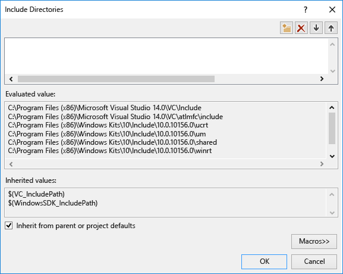
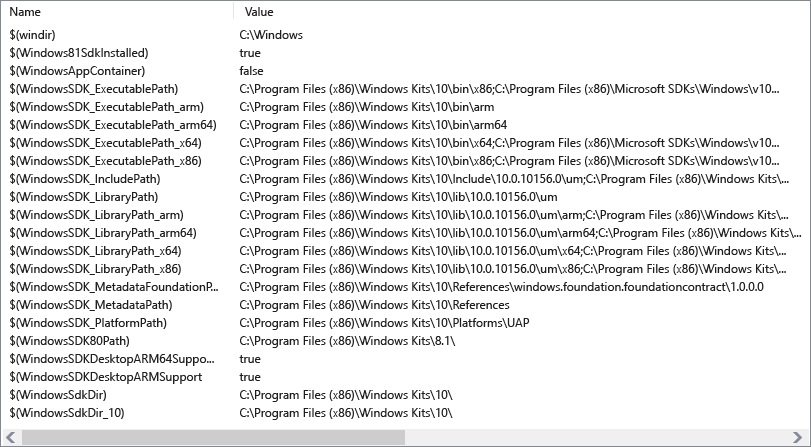

# Como: usar o Windows 10 SDK em um aplicativo de &#225;rea de trabalho do Windows
[!INCLUDE[vs2017banner](../assembler/inline/includes/vs2017banner.md)]

Quando você cria um projeto para desktops Windows clássico em [!INCLUDE[vs_dev14](../mfc/includes/vs_dev14_md.md)], ele é configurado por padrão para compilar com o SDK do Windows 8.1. Esta versão do SDK do Windows é compatível com todas as versões recentes de Windows, incluindo Windows 10, mas ele não contém as funções mais recentes de APIs do Windows 10 e CRT que estejam no SDK do Windows 10. Se você quiser usar as novas APIs, você pode redirecionar seu projeto para referenciar o SDK do Windows 10.  
  
 Começando com [!INCLUDE[vs_dev14](../mfc/includes/vs_dev14_md.md)] e o SDK do Windows 10, da biblioteca CRT foram separado em duas partes: um \(ucrtbase\) que contém as funções que são aceitáveis para ser usado em aplicativos universais do Windows e outro que contém todo o resto \(vcruntime140\). Como o SDK do Windows 10 contém novas funções, como muitas funções C99, você precisa seguir estas etapas para usar essas funções. Consulte [Recursos da biblioteca CRT](../c-runtime-library/crt-library-features.md).  
  
### Destino do SDK do Windows 10  
  
1.  Verifique se que o SDK do Windows 10 está instalado. O SDK do Windows 10 é instalado como parte do [Ferramentas para Windows 10](http://go.microsoft.com/fwlink/?LinkID=617631).  
  
2.  Abra o menu de atalho para o nó do projeto e escolha **Redirecionar SDK versão**.  
  
       
  
     O **ações de solução de análise** caixa de diálogo aparece.  
  
       
  
3.  No **versão da plataforma de destino** lista suspensa, escolha a versão do SDK Windows 10 de destino, ou escolha 8.1 se você quiser fazer alterações. Escolha o botão OK para aplicar a alteração.  
  
     Observe que 8.1 nesse contexto refere\-se a versão do SDK do Windows, que também tem compatibilidade com o Windows 8, Windows Server 2012, Windows 7, Windows Server 2008 e Windows Vista.  
  
     Se essa etapa for bem\-sucedida, o seguinte texto é exibido na janela de saída:  
  
     `Final de redirecionamento: 1 concluída, 0 falhou, 0 ignorado`  
  
4.  Abra as propriedades do projeto e no **Propriedades de configuração, em geral** seção, observe os valores de **versão de plataforma de destino do Windows**. Alterando o valor tem o mesmo efeito que esse procedimento. Consulte [Página de propriedade geral \(projeto\)](../Topic/General%20Property%20Page%20\(Project\).md).  
  
       
  
     Esta ação altera os valores das macros do projeto que incluem caminhos para arquivos de cabeçalho e arquivos de biblioteca. Para ver o que mudou, na seção de diretórios do Visual C\+\+ da caixa de diálogo Propriedades do projeto, escolha uma das propriedades, como os diretórios de inclusão, escolha Abrir a lista suspensa e escolha \< Editar \>. O **diretórios de inclusão** caixa de diálogo aparece.  
  
       
  
     Escolha o **Macros \>\>** botão e role para baixo na lista de macros para as macros do SDK do Windows para ver os novos valores.  
  
       
  
5.  Repita para outros projetos, conforme necessário e recompile a solução.  
  
### Para direcionar o SDK do Windows 8.1  
  
1.  Abra o menu de atalho para o nó do projeto e escolha **Redirecionar SDK versão**.  
  
2.  Na lista suspensa versão da plataforma de destino, escolha 8.1.  
  
## Consulte também  
 [Windows Desktop Applications \(Visual C\+\+\)](../windows/how-to-use-the-windows-10-sdk-in-a-windows-desktop-application.md)